---
## Front matter
title: "ОТЧЕТ ПО ЛАБОРАТОРНОЙ РАБОТЕ № 4"
subtitle: "дисциплина: Архитектура компьютера"
author: "Идрисов Д.А"

## Generic otions
lang: ru-RU
toc-title: "Содержание"

1 Цель работы
2 Задание 
3 Теоретическое введение 
4 Выполнение лабораторной работы
4.2 Транслятор NASM
4.3 Работа с расширенным синтаксисом командной строки NASM
4.4 Работа с компоновщиком LD
4.5 Запуск программы
4.6 Задания для проверки
Выводы
Список литературы.

## Bibliography
bibliography: bib/cite.bib
csl: pandoc/csl/gost-r-7-0-5-2008-numeric.csl

## Pdf output format
toc: true # Table of contents
toc-depth: 2
lof: true # List of figures
lot: true # List of tables
fontsize: 12pt
linestretch: 1.5
papersize: a4
documentclass: scrreprt
## I18n polyglossia
polyglossia-lang:
  name: russian
  options:
	- spelling=modern
	- babelshorthands=true
polyglossia-otherlangs:
  name: english
## I18n babel
babel-lang: russian
babel-otherlangs: english
## Fonts
mainfont: PT Serif
romanfont: PT Serif
sansfont: PT Sans
monofont: PT Mono
mainfontoptions: Ligatures=TeX
romanfontoptions: Ligatures=TeX
sansfontoptions: Ligatures=TeX,Scale=MatchLowercase
monofontoptions: Scale=MatchLowercase,Scale=0.9
## Biblatex
biblatex: true
biblio-style: "gost-numeric"
biblatexoptions:
  - parentracker=true
  - backend=biber
  - hyperref=auto
  - language=auto
  - autolang=other*
  - citestyle=gost-numeric
## Pandoc-crossref LaTeX customization
figureTitle: "Список иллюстраций"
tableTitle: "Цель работы"
listingTitle: "Задания"
lofTitle: "Теоретическое введение"
lotTitle: "Выполнение лабораторной работы"
4.2 Транслятор NASM
4.3 Работа с расширенным синтаксисом командной строки NASM
4.4 Работа с компоновщиком LD
4.5 Запуск программы
4.6 Задания для проверки

lolTitle: "Выводы"
lolTitle: "Список Литературы"
## Misc options
indent: true
header-includes:
  - \usepackage{indentfirst}
  - \usepackage{float} # keep figures where there are in the text
  - \floatplacement{figure}{H} # keep figures where there are in the text
---

# 1 Цель работы

Основной задачей этой работы является приобретение навыков программирования на языке ассемблера NASM.

# 2 Задание

1. Создание программы Hello world! 
2. Работа с транслятором NASM 
3. Работа с расширенным синтаксисом командной строки NASM 
4. Работа с компоновщиком LD 
5. Запуск исполняемого файла 
6. Выполнение заданий для самостоятельной работы. 

# 3 Теоретическое введение

Центральное управляющее устройство (ЦПУ), оперативная память и периферийные устройства представляют собой основные функциональные элементы в любом компьютере. Взаимодействие между ними осуществляется через общую шину, которая представляет собой совокупность проводников, соединяющих все устройства. Физически эти проводники могут быть представлены в виде электропроводящих дорожек на материнской плате современных компьютеров.
Центральному процессору (ЦП) выпадает важная роль в обработке информации и координации работы всех компонентов компьютера. В его состав входят несколько устройств, включая арифметико-логическое устройство (АЛУ), которое выполняет математические и логические операции, необходимые для обработки данных в памяти. Также включено устройство управления, которое управляет и контролирует все остальные устройства компьютера. Регистры, которые являются быстрыми небольшими участками памяти внутри процессора, используются для временного хранения промежуточных результатов операций. Эти регистры бывают общего назначения и специализированные.
Для написания программ на языке ассемблера важно знать, какие регистры процессора существуют и как их использовать, так как большинство инструкций в ассемблере оперируют данными, находящимися в регистрах процессора. Доступ к регистрам осуществляется по их именам, а каждый регистр имеет уникальное имя, состоящее из букв латинского алфавита.
Оперативное запоминающее устройство (ОЗУ) является еще одной важной частью компьютера и используется для хранения программ и данных, с которыми процессор работает в текущий момент. ОЗУ состоит из ячеек памяти, каждая из которых имеет уникальный адрес для хранения данных.
Помимо ЦП и ОЗУ, компьютер также включает периферийные устройства, такие как устройства внешней памяти (для долгосрочного хранения данных) и устройства ввода-вывода (для взаимодействия с внешними устройствами).
В работе компьютера программное управление играет ключевую роль, где задачи выполняются в соответствии с последовательностью команд, записанных в виде программы. Машинные команды представлены двоичными кодами, состоящими из операционной части, определяющей выполняемую операцию, и адресной части, указывающей данные или их адреса, с которыми операция выполняется.
Язык ассемблера (ASM) представляет собой низкоуровневый машинно-ориентированный язык, а NASM (Netwide Assembler) - это открытый ассемблерный проект, который поддерживает различные операционные системы и инструкции архитектуры x86-64, используя синтаксис Intel.

# 4 Выполнение лабораторной работы

Я создаю каталог для работы с программами, используя следующую команду: "mkdir -p ~/work/arch-pc/lab04". (рис. @fig:001).

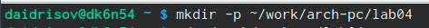{#fig:001 width=70%}

Я перейду в только что созданный каталог. (рис. @fig:002).

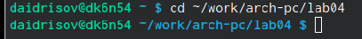{#fig:002 width=70%}

Я создам файл с именем "hello.asm" и после этого открою его (рис. @fig:003) (рис. @fig:004).

{#fig:003 width=70%}

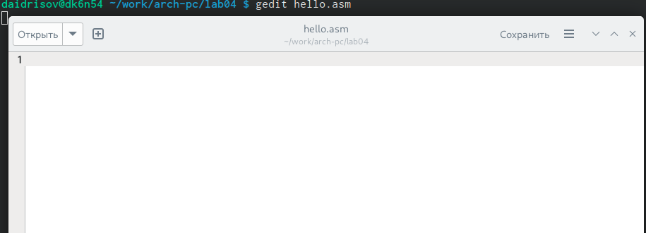{#fig:004 width=70%}

Я проведу редактирование и создам программный код на языке ассемблера NASM. (рис. @fig:005).

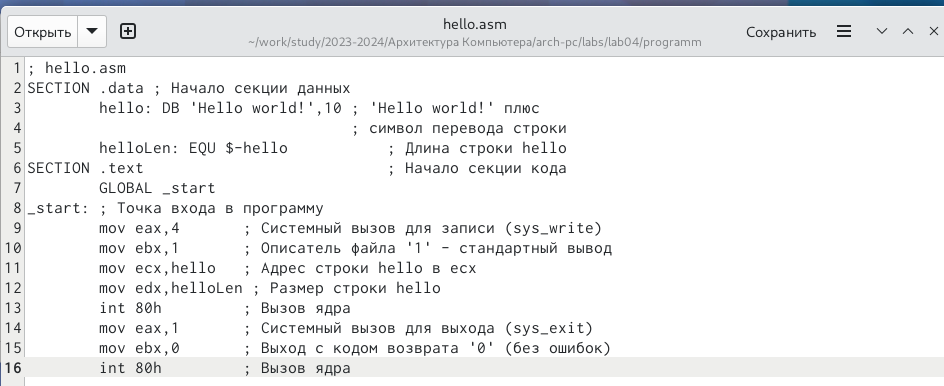{#fig:005 width=70%}

# 4.2 Транслятор NASM

Я преобразую текст программы для вывода "Hello world!" в машинный код с использованием компилятора NASM, используя следующую команду: "nasm -f elf hello.asm". Ключ "-f" указывает компилятору NASM создать бинарный файл в формате ELF.
(рис. @fig:006).

{#fig:006 width=70%}

# 4.3 Работа с расширенным синтаксисом командной строки NASM

Я запускаю команду компиляции для файла "hello.asm", создавая объектный файл с именем "obj.o". При этом добавляю ключи отладки и создаю файл листинга под названием "list.lst". Для удобства работы я переместил все файлы в директорию "~/work/study/2023-2024/Архитектура компьютера/arch-pc/labs/lab04" (рис. @fig:007).

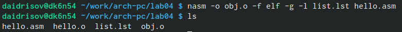{#fig:007 width=70%}

# 4.4 Работа с компоновщиком LD

Я передаю объектный файл "hello.o" компоновщику LD для создания исполняемого файла с именем "hello" (рис. @fig:008).

{#fig:008 width=70%}

Следующей командой я создаю исполняемый файл с именем "main", используя объектный файл "obj.o". Ранее было задано, что объектный файл имеет имя "obj.o". (рис. @fig:009).

{#fig:009 width=70%}

# 4.5 Запуск программы

Я выполняю запуск файла, который выполнит содержащийся в нем код. (рис. @fig:010).

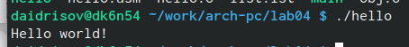{#fig:010 width=70%}

# 4.6 Задания для проверки

Создам копию в текущем файл из файла с именес hello.asm в lab4.asm
(рис. @fig:011).

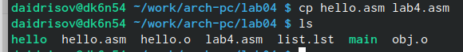{#fig:011 width=70%}

Далее с помощью текстового редактора меняю данные в файле lab4.asm. (рис. @fig:012).

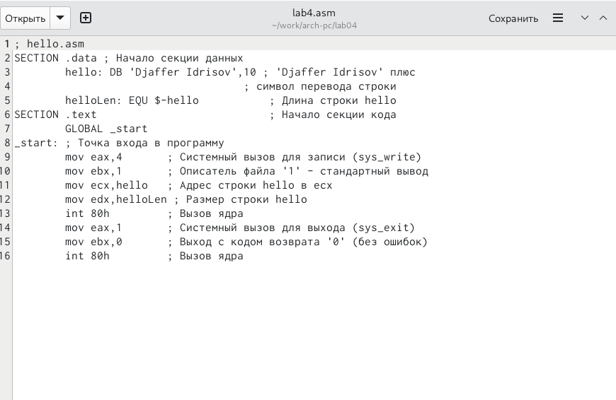{#fig:012 width=70%}

Затем, я компилирую файл "lab4.asm" и создаю из него объектный файл. (рис. @fig:013).

{#fig:013 width=70%}

Я передам объектный файл "lab4.o" компоновщику LD для обработки (рис. @fig:014).

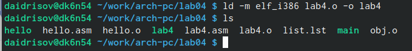{#fig:014 width=70%}

Я выполню запуск программы (рис. @fig:015).

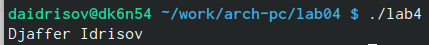{#fig:015 width=70%}

После завершения всех этапов работы, я отправлю файлы в свой собственный репозиторий на GitHub.  (рис. @fig:016).

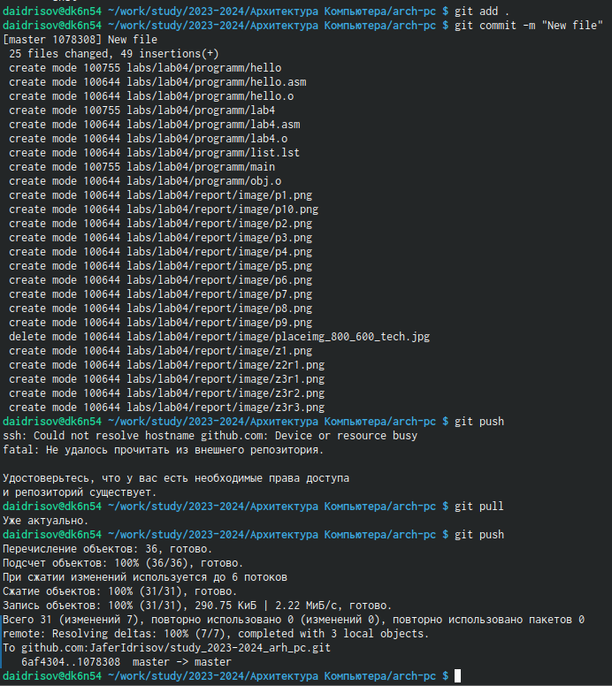{#fig:016 width=70%}

# Выводы

Это занятие помогло мне осознать, как работать с языком программирования Assembler NASM.

# Список литературы{.unnumbered}

https://esystem.rudn.ru/pluginfile.php/2089084/mod_resource/content/0/Лабораторная%20работа%20№4.%20Создание%20и%20процесс%20обработки%20программ%20на%20языке%20ассемблера%20NASM.pdf

::: {#refs}
:::
