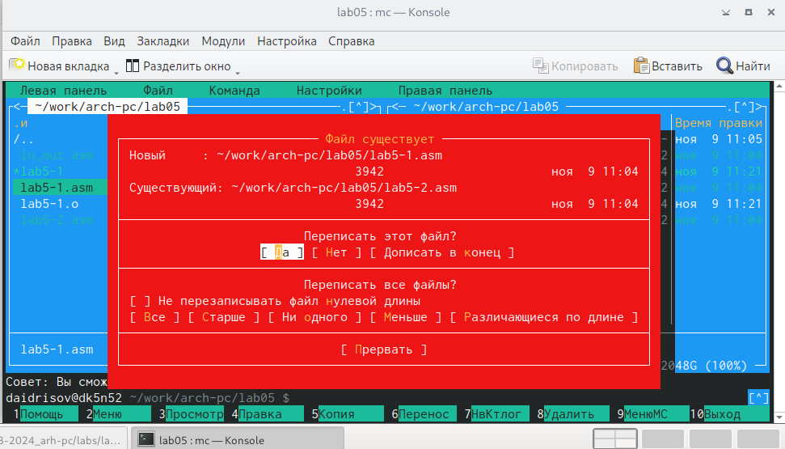
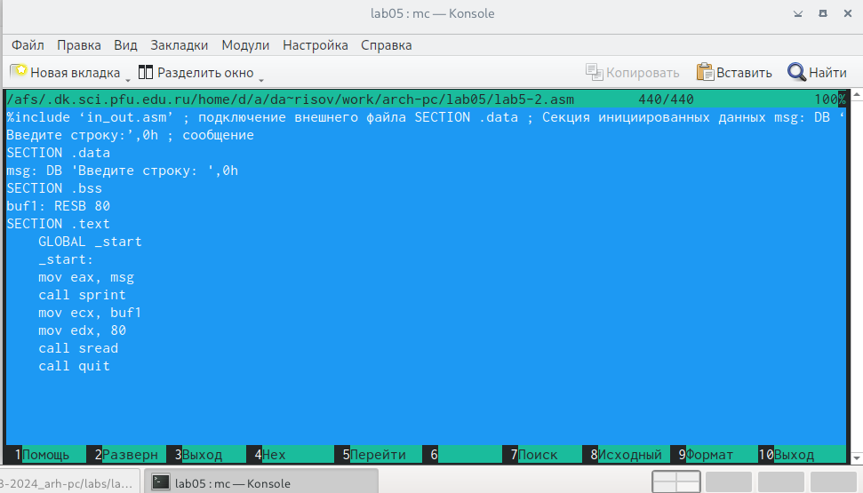

---
## Front matter
title: "ОТЧЕТ по лабораторной работе № 5"
subtitle: "дисциплина:	Архитектура компьютера"
author: "Студент: Идрисов Д.А"

## Generic otions
lang: ru-RU
toc-title: "Содержание"

## Bibliography
bibliography: bib/cite.bib
csl: pandoc/csl/gost-r-7-0-5-2008-numeric.csl

## Pdf output format
toc: true # Table of contents
toc-depth: 2
lof: true # List of figures
lot: true # List of tables
fontsize: 12pt
linestretch: 1.5
papersize: a4
documentclass: scrreprt
## I18n polyglossia
polyglossia-lang:
  name: russian
  options:
	- spelling=modern
	- babelshorthands=true
polyglossia-otherlangs:
  name: english
## I18n babel
babel-lang: russian
babel-otherlangs: english
## Fonts
mainfont: PT Serif
romanfont: PT Serif
sansfont: PT Sans
monofont: PT Mono
mainfontoptions: Ligatures=TeX
romanfontoptions: Ligatures=TeX
sansfontoptions: Ligatures=TeX,Scale=MatchLowercase
monofontoptions: Scale=MatchLowercase,Scale=0.9
## Biblatex
biblatex: true
biblio-style: "gost-numeric"
biblatexoptions:
  - parentracker=true
  - backend=biber
  - hyperref=auto
  - language=auto
  - autolang=other*
  - citestyle=gost-numeric
## Pandoc-crossref LaTeX customization
tableTitle: "Цель работы"
listingTitle: "Задание"
lofTitle: "Теоретическое введение"
lotTitle: "Выполнение лабораторной работы"
lotTitle: "1 Основы работы с mc."
lotTitle: "2 Структура программы на языке ассемблера NASM."
lotTitle: "3 Подключение внешнего файла."
lotTitle: "4 Выполнение заданий."
lolTitle: "Выводы"
lolTitle: "Список литературы"
## Misc options
indent: true
header-includes:
  - \usepackage{indentfirst}
  - \usepackage{float} # keep figures where there are in the text
  - \floatplacement{figure}{H} # keep figures where there are in the text
---

# Цель работы

Целью данной лабораторной работы является приобретение практических навыков работы в Midnight Commander, освоение инструкций языка ассемблера mov и int.

# Задание

1.Основы работы с mc 

2.Структура программы на языке ассемблера NASM 

3.Подключение внешнего файла 

4.Выполнение заданий для самостоятельной работы

# Теоретическое введение

Midnight Commander (или просто mc) — это программа, которая позволяет просматривать структуру каталогов и выполнять основные операции по управлению файловой системой, т.е. mc является файловым менеджером. Midnight Commander позволяет сделать работу с файлами более удобной и наглядной. Программа на языке ассемблера NASM, как правило, состоит из трёх секций: секция кода программы (SECTION .text), секция инициированных (известных во время компиляции) данных (SECTION .data) и секция неинициализированных данных (тех, под которые во время компиляции только отводится память, а значение присваивается в ходе выполнения программы) (SECTION .bss). Для объявления инициированных данных в секции .data используются директивы DB, DW, DD, DQ и DT, которые резервируют память и указывают, какие значения должны храниться в этой памяти: - DB (define byte) — определяет переменную размером в 1 байт; - DW (define word) — определяет переменную размеров в 2 байта (слово); - DD (define double word) — определяет переменную размером в 4 байта (двойное слово); - DQ (define quad word) — определяет переменную размером в 8 байт (учетве- рённое слово); - DT (define ten bytes) — определяет переменную размером в 10 байт. Директивы используются для объявления простых переменных и для объявления массивов. Для определения строк принято использовать директиву DB в связи с особенностями хранения данных в оперативной памяти. Инструкция языка ассемблера mov предназначена для дублирования данных источника в приёмнике. 

mov dst,src 

Здесь операнд dst — приёмник, а src — источник. В качестве операнда могут выступать регистры (register), ячейки памяти (memory) и непосредственные значения (const). Инструкция языка ассемблера intпредназначена для вызова прерывания с указанным номером. 

int n 

Здесь n — номер прерывания, принадлежащий диапазону 0–255. При программировании в Linux с использованием вызовов ядра sys_calls n=80h (принято задавать в шестнадцатеричной системе счисления).

# Выполнение лабораторной работы

## 1 Основы работы с mc.

Я запускаю Midnight Commander, используя команду "mc". (рис. @fig:001).

{#fig:001 width=70%}

Перехожу в каталог ~/work/arch-pc (рис. @fig:002).

{#fig:002 width=70%}

Создаю папку с именем "lab05" с помощью функциональной клавиши F7, и после этого выполняю команду "touch lab5-1.asm" (рис. @fig:003).

{#fig:003 width=70%}

## 2 Структура программы на языке ассемблера NASM.

Используя функциональную клавишу F4, открою файл в текстовом редакторе nano для редактирования. (рис. @fig:004).

{#fig:004 width=70%}

Добавлю в файл программный код, который будет запрашивать строку у пользователя. (рис. @fig:005).

{#fig:005 width=70%}

Используя функциональную клавишу F3, мы можем открыть файл для просмотра и проверить его содержимое, чтобы убедиться в наличии текста программы. (рис. @fig:006).

{#fig:006 width=70%}

Я проведу процесс компиляции моей программы, начиная с трансляции текста программы в объектный файл с использованием команды "nasm -f elf lab5-1.asm". Затем выполню компоновку файла с помощью команды "ld -m elf_i386 -o lab5-1 lab5-1.o". Наконец, запущу программу с помощью команды "./lab5-1". (рис. @fig:007).

{#fig:007 width=70%} 

## 3.Подключение внешнего файла

Я загружаю файл на ТУИС и проверяю, что он был успешно загружен в папке, где лежит наша программа. Сразу же выполняю копирование этого файла в программу lab5-1.asm (рис. @fig:008) (рис. @fig:009).

{#fig:008 width=70%}
{#fig:009 width=70%}

Изменяю текст программы и просмотриваю код (рис. @fig:010).

{#fig:010 width=70%} 

Запускаю программу (рис. @fig:011).

{#fig:011 width=70%}
 
# Выполнение заданий

№1 Я скопирую файл "lab5-1.asm", используя клавишу F5, чтобы создать его дубликат. (рис. @fig:012).

{#fig:012 width=70%}

Я внесу изменения в код, используя клавишу F4 для редактирования. (рис. @fig:013).

{#fig:013 width=70%}

№2 Выполняем компоновку и запускаем программу. (рис. @fig:014).

{#fig:014 width=70%}

№3 Создам копию файла lab5-2.asm (использую клавишу F5). (рис. @fig:015).

{#fig:015 width=70%}

Я исправлю код программы и интегрирую в него внешний файл "in_out.asm" для его работы.(рис. @fig:016).

{#fig:016 width=70%}

№4 Выполню компоновку и запускаю программу (рис. @fig:017).

{#fig:016 width=70%}

# Выводы

В результате выполнения этой лабораторной работы, я получил практические навыки, которые наверняка будут полезными при работе с различными языками программирования.

# Список литературы{.unnumbered}

Лабораторная работа №5. Основы работы с Midnight Commander (mc). Структура программы на языке ассемблера NASM. Системные вызовы в ОС GNU Linux

::: {#refs}
:::
