---
## Front matter
title: "ОТЧЕТ по лабораторной работе № 6"
subtitle: "дисциплина:	Архитектура компьютера"
author: "Студент: Идрисов Д.А"

## Generic otions
lang: ru-RU
toc-title: "Содержание"


## Bibliography
bibliography: bib/cite.bib
csl: pandoc/csl/gost-r-7-0-5-2008-numeric.csl

## Pdf output format
toc: true # Table of contents
toc-depth: 2
lof: true # List of figures
lot: true # List of tables
fontsize: 12pt
linestretch: 1.5
papersize: a4
documentclass: scrreprt
## I18n polyglossia
polyglossia-lang:
  name: russian
  options:
	- spelling=modern
	- babelshorthands=true
polyglossia-otherlangs:
  name: english
## I18n babel
babel-lang: russian
babel-otherlangs: english
## Fonts
mainfont: PT Serif
romanfont: PT Serif
sansfont: PT Sans
monofont: PT Mono
mainfontoptions: Ligatures=TeX
romanfontoptions: Ligatures=TeX
sansfontoptions: Ligatures=TeX,Scale=MatchLowercase
monofontoptions: Scale=MatchLowercase,Scale=0.9
## Biblatex
biblatex: true
biblio-style: "gost-numeric"
biblatexoptions:
  - parentracker=true
  - backend=biber
  - hyperref=auto
  - language=auto
  - autolang=other*
  - citestyle=gost-numeric
## Pandoc-crossref LaTeX customization
figureTitle: "Рис."
listingTitle: "Листинг"
lofTitle: "Список иллюстраций"
lolTitle: "Листинги"
## Misc options
indent: true
header-includes:
  - \usepackage{indentfirst}
  - \usepackage{float} # keep figures where there are in the text
  - \floatplacement{figure}{H} # keep figures where there are in the text
---

# Цель работы

Цель этого лабораторного исследования заключается в изучении арифметических инструкций языка ассемблера NASM.

# Задания

1. Символьные и численные данные в NASM
2. Выполнение арифметических операций в NASM
3. Выполнение заданий для самостоятельной работы

# Теоретическое введение

Большинство команд в языке ассемблера требуют обработки операндов, которые представляют место, где хранятся данные для последующей обработки. Эти данные могут находиться в регистрах или в ячейках памяти. Существуют три основных типа адресации:

Регистровая адресация, при которой операнды хранятся в регистрах и их имена используются в командах, например: mov ax, bx.
Непосредственная адресация, где значение операнда задается непосредственно в команде, например: mov ax, 2.
Адресация памяти, где операнд указывает на адрес в памяти, используя символическое обозначение ячейки памяти, над содержимым которой выполняется операция.
Ввод данных с клавиатуры и вывод на экран обычно осуществляются в символьной форме, используя коды ASCII. Каждый символ кодируется одним байтом согласно стандарту ASCII. Некоторые команды NASM не предоставляют прямого вывода чисел (не в символьной форме), поэтому для вывода чисел на экран необходимо предварительно преобразовать их цифры в ASCII-коды.

При вводе данных с клавиатуры также возникает необходимость преобразования ASCII-символов в числа для корректного выполнения арифметических операций.

Таким образом, для решения этих проблем необходимо проводить преобразование между ASCII и числовыми значениями при вводе и выводе данных.

# Выполнение лабораторной работы

## 1 Символьные и численные данные в NASM

Давайте перейдем в репозиторий и используем команду для создания файла с именем lab6-1.asm.(рис. [-@fig:001]).

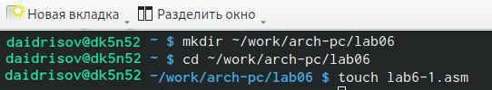{ #fig:001 width=70% }

Я скопирую файл in_out.asm в наш репозиторий и приступлю к редактированию файла lab6-1.asm.(рис. [-@fig:002]).

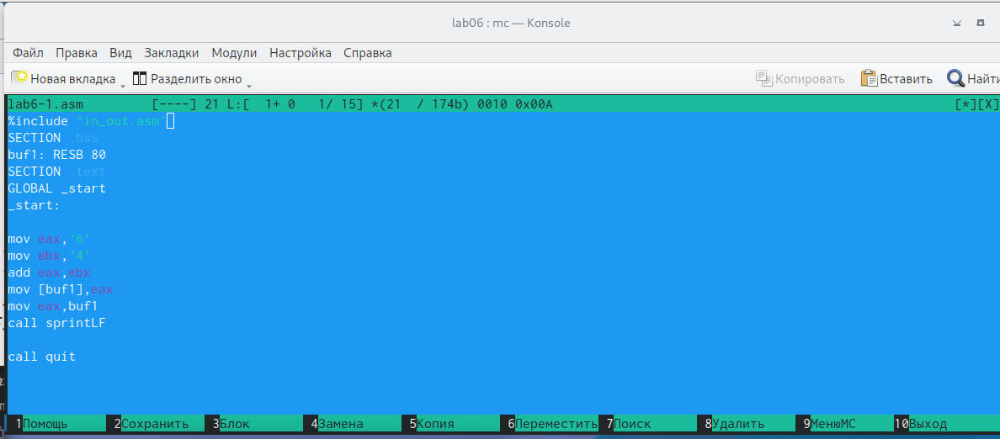{ #fig:002 width=70% }

После запуска файла мы увидим символ 'j', так как программа выводит результат, соответствующий сумме двоичных кодов символов '4' и '6' в системе ASCII. (рис. [-@fig:003]).

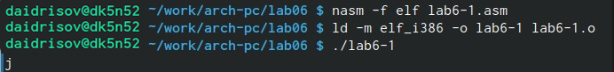{ #fig:003 width=70% }

Я заменяю символы "6" и "4" в тексте программы на цифры 6 и 4. (рис. [-@fig:004]).

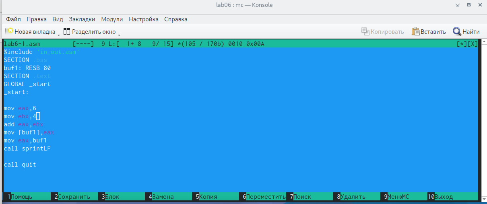{ #fig:004 width=70% }

После выполнения программы я замечу, что выводится символ с кодом 10, что соответствует символу перевода строки. Этот символ не будет виден при выводе на экран.(рис. [-@fig:005]).

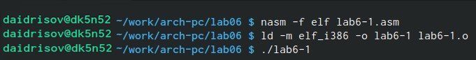{ #fig:005 width=70% }

## Выполнение арифметических операций в NASMц

Я создам файл с именем lab6-3.asm для последующих заданий. (рис. [-@fig:006]).

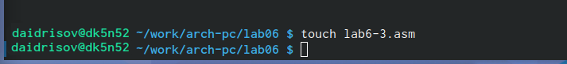{ #fig:006 width=70% }

Я внесу новый код для вычисления математической формулы. (рис. [-@fig:007]).

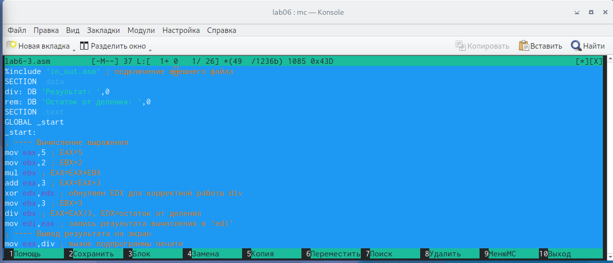{ #fig:007 width=70% }

Мы выполним запуск файла и убедимся, что все операции выполняются корректно. (рис. [-@fig:008]).

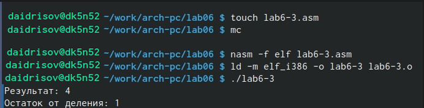{ #fig:008 width=70% }

Я внесу изменения в файл, после чего перезапущу программу, чтобы убедиться в правильности её работы. (рис. [-@fig:009]) (рис. [-@fig:010]).

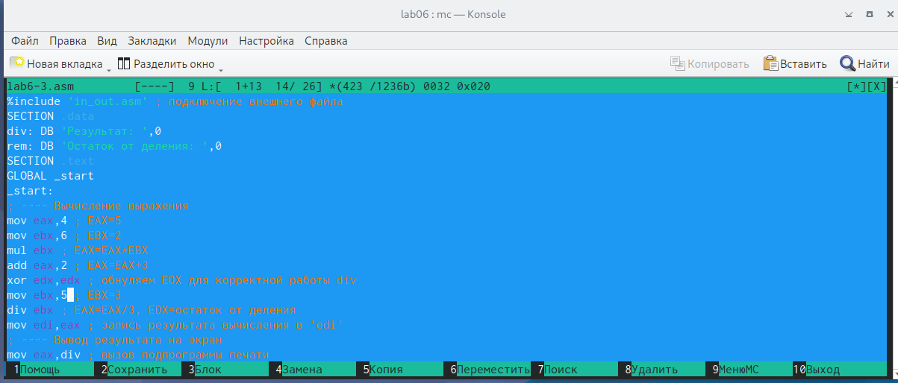{ #fig:009 width=70% }

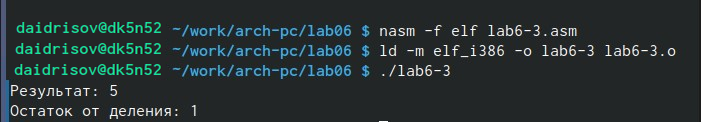{ #fig:010 width=70% }

Я сформирую файл с названием "variant". (рис. [-@fig:011]).

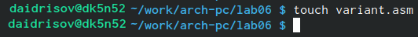{ #fig:011 width=70% } 

Я проведу редактирование файла. (рис. [-@fig:012]).

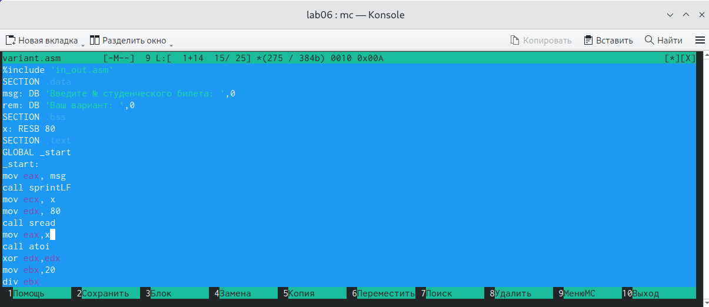{ #fig:012 width=70% } 

Я выполняю запуск программы. (рис. [-@fig:013]).

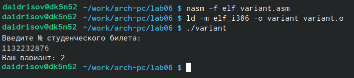{ #fig:013 width=70% } 

## Задание для самостоятельной работы

1. Ответственные за вывод сообщения "Ваш вариант" являются строки кода:

```NASM
mov eax,rem
call sprint
```
2. Инструкция mov ecx, x применяется для помещения адреса вводимой строки x в регистр ecx. Затем, с использованием инструкции mov edx, 80, указывается в регистр edx длина вводимой строки. Далее, вызывается подпрограмма sread из внешнего файла с помощью команды call sread, обеспечивающая ввод сообщения с клавиатуры.  

3. Инструкция call atoi применяется для вызова подпрограммы из внешнего файла, которая осуществляет преобразование ASCII-кода символа в целое число и сохраняет результат в регистре eax.

4. Вычисление варианта осуществляется в следующих строках кода:

```NASM
xor edx,edx ; обнуление edx для корректной работы div
mov ebx,20 ; ebx = 20
div ebx ; eax = eax/20, edx - остаток от деления
inc edx ; edx = edx + 1
```

5. При выполнении инструкции div ebx, остаток от деления помещается в регистр edx.

6. Инструкция inc edx увеличивает значение регистра edx на 1.

7. Ответственные за вывод результатов вычислений на экран строки кода:

```NASM
mov eax,edx
call iprintLF
```

# Выполнение заданий

Я разработаю программу для выполнения поставленной задачи. (рис. [-@fig:014]).

{ #fig:014 width=70% } 

Я вношу изменения в файл, чтобы обеспечить корректное выполнение и вычисление моей задачи. (рис. [-@fig:015]).

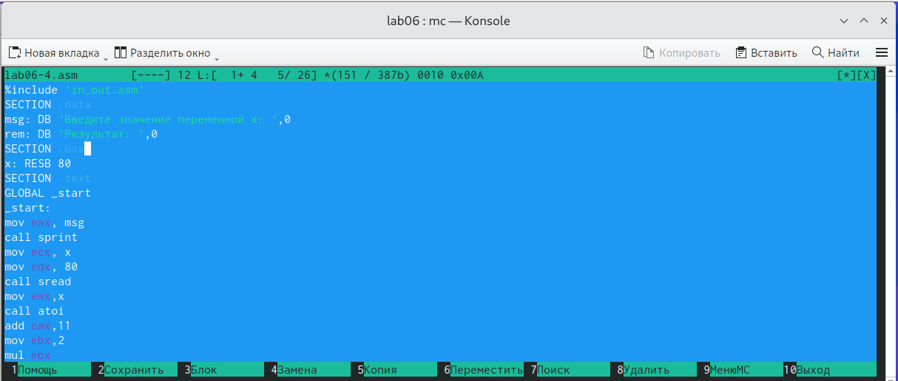{ #fig:015 width=70% } 

Я выполню запуск программы. (рис. [-@fig:016]).

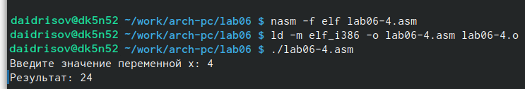{ #fig:016 width=70% } 

# Выводы

В процессе выполнения данной лабораторной работы я приобрела навыки использования арифметических инструкций в языке ассемблера NASM.

# Список литературы

Лабораторная работа No6. Арифметические операции в NASM.
::: {#refs}
:::
