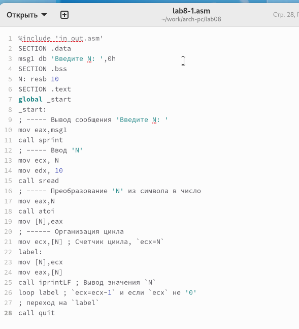
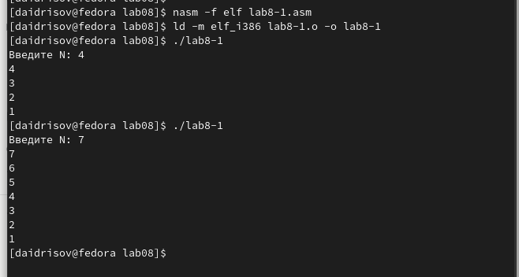
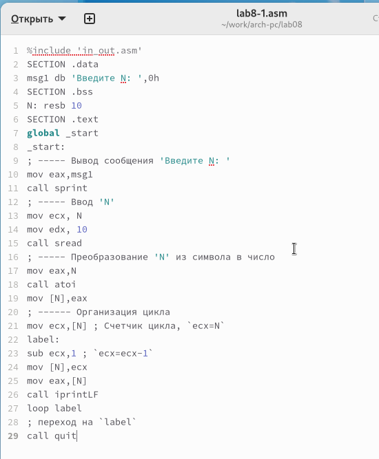
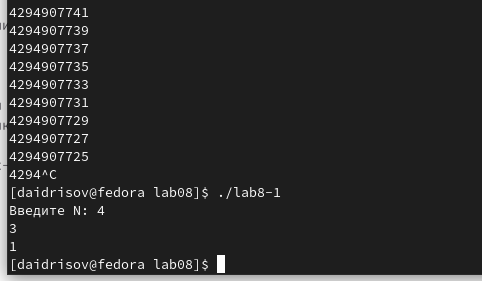
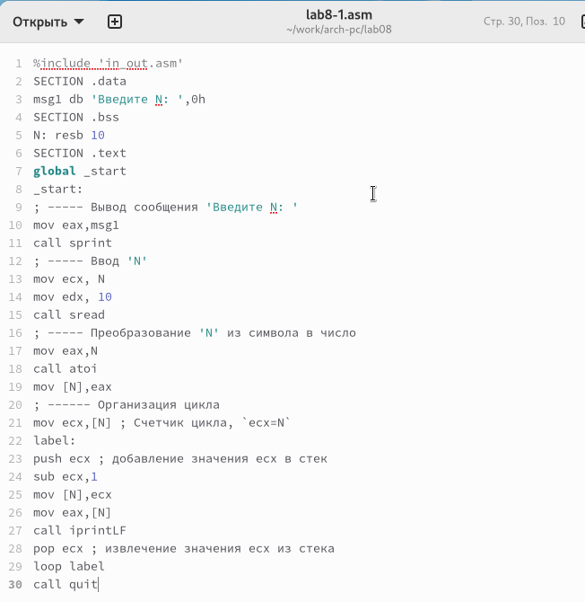
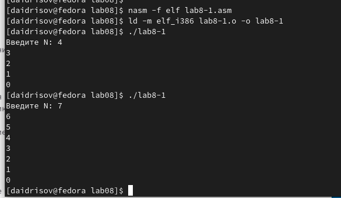
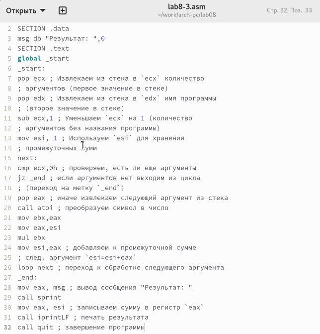
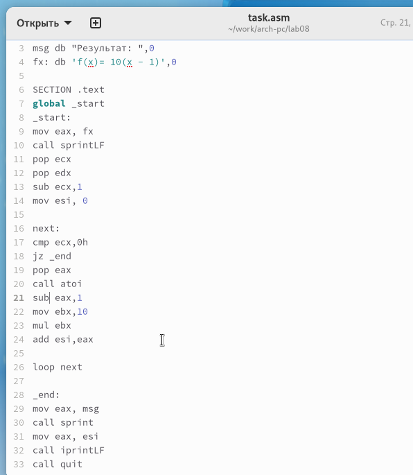
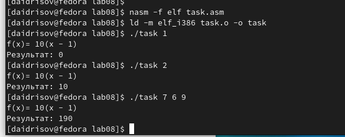

---
## Front matter
title: "ОТЧЕТ по лабораторной работе №8"
title: "ОТЧЕТ по лабораторной работе №8"
subtitle: "дисциплина: Архитектура компьютера"
author: "Студент: Идрисов Д.А."

## Generic otions
lang: ru-RU
toc-title: "Содержание"

## Bibliography
bibliography: bib/cite.bib
csl: pandoc/csl/gost-r-7-0-5-2008-numeric.csl

## Pdf output format
toc: true # Table of contents
toc-depth: 2
lof: true # List of figures
lot: true # List of tables
fontsize: 12pt
linestretch: 1.5
papersize: a4
documentclass: scrreprt
## I18n polyglossia
polyglossia-lang:
  name: russian
  options:
	- spelling=modern
	- babelshorthands=true
polyglossia-otherlangs:
  name: english
## I18n babel
babel-lang: russian
babel-otherlangs: english
## Fonts
mainfont: PT Serif
romanfont: PT Serif
sansfont: PT Sans
monofont: PT Mono
mainfontoptions: Ligatures=TeX
romanfontoptions: Ligatures=TeX
sansfontoptions: Ligatures=TeX,Scale=MatchLowercase
monofontoptions: Scale=MatchLowercase,Scale=0.9
## Biblatex
biblatex: true
biblio-style: "gost-numeric"
biblatexoptions:
  - parentracker=trueЗырянов Артём Алексеевич	НБИбд-01-22

  - backend=biber
  - hyperref=auto
  - language=auto
  - autolang=other*
  - citestyle=gost-numeric
## Pandoc-crossref LaTeX customization
figureTitle: "Рис."
tableTitle: "Таблица"
listingTitle: "Листинг"
lofTitle: "Список иллюстраций"
lotTitle: "Список таблиц"
lolTitle: "Листинги"
## Misc options
indent: true
header-includes:
  - \usepackage{indentfirst}
  - \usepackage{float} # keep figures where there are in the text
  - \floatplacement{figure}{H} # keep figures where there are in the text
---

# Цель работы

Целью работы является приобретение навыков написания программ с использованием циклов и обработкой аргументов командной строки..

# Задание

1. Изучение стека и цикла в ассемблере

2. Изучение примеров программ со стеком

3. Изучение примеров программ с аргументами

4. Выполнение заданий для самостоятельной работы

# Теоретическое введение

Стек — это структура данных, организованная по принципу LIFO («Last In — First Out»
или «последним пришёл — первым ушёл»). Стек является частью архитектуры процессора и
реализован на аппаратном уровне. Для работы со стеком в процессоре есть специальные
регистры (ss, bp, sp) и команды.

Для стека существует две основные операции:

* добавление элемента в вершину стека (push);

* извлечение элемента из вершины стека (pop).

Команда push размещает значение в стеке, т.е. помещает значение в ячейку памяти, на
которую указывает регистр esp, после этого значение регистра esp увеличивается на 4.
Данная команда имеет один операнд — значение, которое необходимо поместить в стек.

Существует ещё две команды для добавления значений в стек. Это команда pusha, которая
помещает в стек содержимое всех регистров общего назначения в следующем порядке: ах,
сх, dx, bх, sp, bp, si, di. А также команда pushf, которая служит для перемещения в стек
содержимого регистра флагов. Обе эти команды не имеют операндов.

Команда pop извлекает значение из стека, т.е. извлекает значение из ячейки памяти, на
которую указывает регистр esp, после этого уменьшает значение регистра esp на 4. У этой
команды также один операнд, который может быть регистром или переменной в памяти.

Аналогично команде записи в стек существует команда popa, которая восстанавливает
из стека все регистры общего назначения, и команда popf для перемещения значений из
вершины стека в регистр флагов.

# Выполнение лабораторной работы

## Реализация циклов в NASM

Создал каталог для программам лабораторной работы № 8 и файл lab8-1.asm

При использовании инструкции loop в NASM для реализации циклов, необходимо учитывать, 
что она использует регистр ecx в качестве счетчика и на каждом шаге уменьшает его значение 
на единицу. Для наглядности рассмотрим программу, которая выводит значение регистра ecx.

Написал в файл lab8-1.asm текст программы из листинга 8.1. 
Создал исполняемый файл и проверил его работу.

{ #fig:001 width=70%, height=70% }

{ #fig:002 width=70%, height=70% }

Однако, в данном примере становится очевидно, что использование регистра ecx в теле цикла 
loop может привести к некорректной работе программы. Чтобы исправить это, 
мы можем использовать стек для сохранения значения счетчика цикла loop.
Программа запускает бесконечный цикл при нечетном N и выводит только нечетные числа при четном N.

{ #fig:003 width=70%, height=70% }

{ #fig:004 width=70%, height=70% }

Внесем изменения в текст программы, добавив команды push и pop, чтобы сохранить и извлечь 
значение счетчика из стека соответственно. После этого создадим исполняемый файл и 
проверим его работу. Таким образом, мы обеспечим корректность работы программы.

Создал исполняемый файл и проверьте его работу. 
Программа выводит числа от N-1 до 0, число проходов цикла соответсвует N.

{ #fig:005 width=70%, height=70% }

{ #fig:006 width=70%, height=70% }

## Обработка аргументов командной строки

Создал файл lab8-2.asm в каталоге ~/work/arch-pc/lab08 и ввел в него текст 
программы из листинга 8.2.

Создал исполняемый файл и запустил его, указав аргументы.
Программа обработала 5 аргументов. Аргументами считаются слова/числа, разделенные пробелом.

{ #fig:009 width=70%, height=70% }

{ #fig:010 width=70%, height=70% }

Изменл текст программы из листинга 8.3 для вычисления произведения
аргументов командной строки.

{ #fig:011 width=70%, height=70% }

{ #fig:012 width=70%, height=70% }

## Задание для самостоятельной работы

Напишите программу, которая находит сумму значений функции $f(x)$ для $x = x_1, x_2, ..., x_n$, 
т.е. программа должна выводить значение $f(x_1) + f(x_2)+ ... +f(x_n)$. 
Значения $x$ передаются как аргументы. 
Вид функции $f(x)$ выбрать из таблицы 8.1 вариантов заданий в соответствии с вариантом, 
полученным при выполнении лабораторной работы № 7. 
Создайте исполняемый файл и проверьте его работу на нескольких наборах $x$.

для варианта 17 $f(x) = 10(x - 1)$

{ #fig:013 width=70%, height=70% }

Для проверки я запустил сначала с одним аргументом. Так, при подстановке $f(0)=7*1=7, f(1)=7*2=14$

Затем подал несколько аргументов и получил сумму значений функции.

{ #fig:014 width=70%, height=70% }

# Выводы

Освоили работы со стеком, циклом и аргументами на ассемблере nasm.